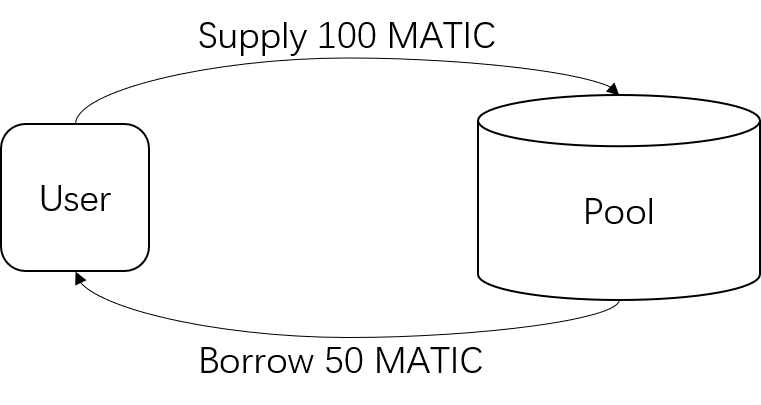

# Tutorial-DeFi-Lending-Platform

Build a DeFi Lending Platform from scratch, which involves compiling, deploying and calling smart contracts.

## 0. Introduction

Lending protocols are fundamental to Decentralized Finance (DeFi). There have been a variety of outstanding lending protocols on different chains, such as Aave, Compound, etc.. For the entire list you can refer to https://defillama.com/protocols/Lending.

In this session, we will build a simple lending protocol, where users can supply any assets freely and borrow asset from those he / she has supplied. The following figure describes how the protocol works.



In the real world lending protocols will include much more complication and need to manage properly a series of risks. Therefore, please DO NOT use this code for your own application on public chains.

We are using *Hardhat* to build dApp in this tutorial. Hardhat is a development environment for Ethereum software. It consists of different components for editing, compiling, debugging and deploying your smart contracts and dApps, all of which work together to create a complete development environment.

> Hardhat Reference: https://hardhat.org/hardhat-runner/docs/getting-started

## 1. Environment Setup

### Setup Hardhat

First initialize the environment by running the following command:

```bash
npm install
```

In order to deploy your dApp on Polygon Network or Mumbai Testnet, you need to include your private key in `hardhat.config.js` by modifying the following:

```bash
vim ./hardhat.config.js

// Include your Private Key HERE
const PRIVATE_KEY = ${YOUR_PRIVATE_KEY_HERE};
```

## 2. Code Your Smart Contract

### `IPool.sol`

Create `IPool.sol` under `contracts/`.

```solidity
// SPDX-License-Identifier: MIT OR Apache-2.0
pragma solidity ^0.8.3;

interface IPool {
    event Deposit(address assetAddress, uint256 amount);
    event Withdraw(address assetAddress, uint256 amount);
    event Borrow(address assetAddress, uint256 amount);
    event Repay(address assetAddress, uint256 amount);

    /**
     * @dev Deposit an `amount` of underlying asset into the reserve
     * @param assetAddress The address of the underlying asset to deposit
     * @param amount The amount to deposit
     **/
    function deposit(address assetAddress, uint256 amount) external;

    /**
     * @dev Withdraws an `amount` of underlying asset from the reserve
     * @param assetAddress The address of the underlying asset to withdraw
     * @param amount The underlying amount to be withdrawn
     *   - Send the value type(uint256).max in order to withdraw the whole balance
     * @return The final amount withdrawn
     **/
    function withdraw(address assetAddress, uint256 amount) external returns (uint256);

    /**
     * @dev Allows users to borrow a specific `amount` of the reserve underlying asset, provided that the borrower
     * already supplied enough collateral
     * @param assetAddress The address of the underlying asset to borrow
     * @param amount The amount to be borrowed
     **/
    function borrow(address assetAddress, uint256 amount) external;

    /**
     * @notice Repays a borrowed `amount` on a specific underlying asset
     * @param assetAddress The address of the borrowed underlying asset previously borrowed
     * @param amount The amount to repay
     * - Send the value type(uint256).max in order to repay the whole debt for `assetAddress`
     * @return The final amount repaid
     **/
    function repay(address assetAddress, uint256 amount) external returns (uint256);
}
```

### `Pool.sol`

Create `Pool.sol` under `contracts/`.

```solidity
// SPDX-License-Identifier: MIT OR Apache-2.0
pragma solidity ^0.8.3;

import {IPool} from "./IPool.sol";
import {IERC20} from "@openzeppelin/contracts/token/ERC20/IERC20.sol";
import {SafeERC20} from "@openzeppelin/contracts/token/ERC20/utils/SafeERC20.sol";

contract Pool is IPool {
    /** libraries */
    using SafeERC20 for IERC20;

    /** storage */
    // user deposit / borrow data, mapped by asset => user => value
    mapping(address => mapping(address => uint256)) private _userDeposits;
    mapping(address => mapping(address => uint256)) private _userBorrows;
    uint256 public constant _ltv = 5e17;
    uint256 private constant PRICE_PRECISION = 1e18;

    /** constructor */
    constructor() {}

    /// @inheritdoc IPool
    function deposit(address assetAddress, uint256 amount) external {
        require(amount != 0, "Invalid deposit");
        IERC20(assetAddress).safeTransferFrom(msg.sender, address(this), amount);
        _userDeposits[assetAddress][msg.sender] += amount;

        emit Deposit(assetAddress, amount);
    }

    /// @inheritdoc IPool
    function withdraw(address assetAddress, uint256 amount) external returns (uint256) {
        uint256 userBalance = _userDeposits[assetAddress][msg.sender];
        uint256 amountToWithdraw = amount;
        if (amountToWithdraw >= userBalance) {
            amountToWithdraw = userBalance;
        }

        bool valid = verifyUserHealth(assetAddress, msg.sender, amountToWithdraw);
        require((userBalance != 0) && (amountToWithdraw != 0) && valid, "Invalid withdraw");

        IERC20(assetAddress).safeTransfer(msg.sender, amountToWithdraw);
        _userDeposits[assetAddress][msg.sender] -= amountToWithdraw;

        emit Withdraw(assetAddress, amount);
        return amountToWithdraw;
    }

    /** External Functions */
    /// @inheritdoc IPool
    function borrow(address assetAddress, uint256 amount) external {
        bool valid = verifyUserHealth(assetAddress, msg.sender, 0);
        require(valid && (amount != 0), "Invalid borrow");

        IERC20(assetAddress).safeTransfer(msg.sender, amount);
        _userBorrows[assetAddress][msg.sender] += amount;

        emit Borrow(assetAddress, amount);
    }

    /// @inheritdoc IPool
    function repay(address assetAddress, uint256 amount) external returns (uint256) {
        uint256 userDebt = _userBorrows[assetAddress][msg.sender];
        require((amount != 0) && (userDebt != 0), "Invalid repay");
        uint256 amountToRepay = amount;
        if (amountToRepay > userDebt) {
            amountToRepay = userDebt;
        }

        IERC20(assetAddress).safeTransferFrom(msg.sender, address(this), amountToRepay);
        _userBorrows[assetAddress][msg.sender] -= amountToRepay;

        emit Repay(assetAddress, amount);
        return amountToRepay;
    }

    /** Internal Functions */
    // health factor verification
    function verifyUserHealth(address asset, address user, uint256 amountToWithdraw) internal view returns (bool) {
        uint256 userDepositAmount = _userDeposits[asset][user];
        uint256 userBorrowAmount = _userBorrows[asset][user];
        if (userDepositAmount < amountToWithdraw) return false;
        uint256 borrowBalance = preMul(_ltv, userDepositAmount - amountToWithdraw);
        if (userBorrowAmount < borrowBalance) return false;
        return true;
    }

    // math util for multiplication a * b
    function preMul(uint256 a, uint256 b) internal pure returns (uint256) {
        return (a * b + PRICE_PRECISION / 2) / PRICE_PRECISION;
    }

    // math util for devision a / b
    function preDiv(uint256 a, uint256 b) internal pure returns (uint256) {
        return (a * PRICE_PRECISION + PRICE_PRECISION / 2) / b;
    }
}
```


## 3. Compile & Deploy Your Smart Contract

In this section, the smart contract is compiled and deployed using *Hardhat*.

### Compile

To compile the smart contract, since you have your `hardhat.config.js` ready, just run the following script:

```bash
npx hardhat compile
```

### Deploy

Before deployment, we need to write the deployment script first. Create a file named `deploy.js` under `scripts/` with the following code.

```javascript
// We require the Hardhat Runtime Environment explicitly here. This is optional
// but useful for running the script in a standalone fashion through `node <script>`.
//
// When running the script with `npx hardhat run <script>` you'll find the Hardhat
// Runtime Environment's members available in the global scope.
const { parseUnits, concat } = require("ethers/lib/utils");
const hre = require("hardhat");
const { ethers } = require("hardhat");

async function main() {
  // 1. Get deployer
  const [deployer] = await hre.ethers.getSigners();
  console.log("Deployer address: ", deployer.address);

  // 2. Depoly pool
  const Pool = await hre.ethers.getContractFactory("Pool");
  let pool = await Pool.deploy();
  await pool.deployed();
  console.log("Pool Address: ", pool.address);
}

// We recommend this pattern to be able to use async/await everywhere
// and properly handle errors.
main()
  .then(() => process.exit(0))
  .catch((error) => {
    console.error(error);
    process.exit(1);
  });
```

To deploy the smart contract on localhost, please first start a local node in another terminal:

```bash
npx hardhat node
```

Then run the deployment script:

```bash
npx hardhat run ./scripts/deploy.js --network localhost
```

If you want to deploy to testnet or Polygon Network, please make sure first that you have included your private key in `hardhat.config.js`, and then run the deployment script:

```bash
npx hardhat run ./scripts/deploy.js --network Polygon
```